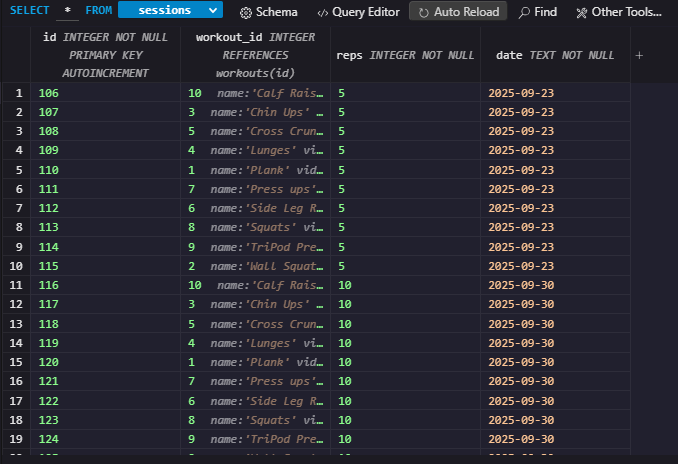
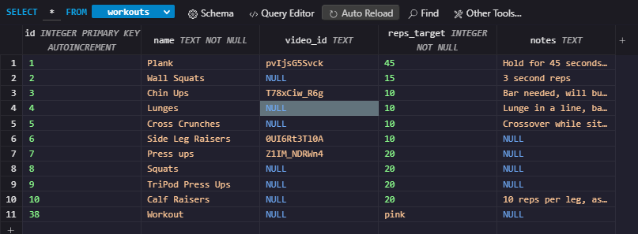
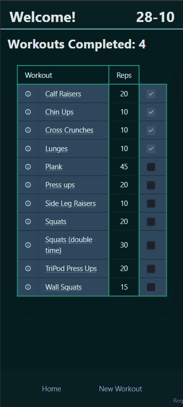
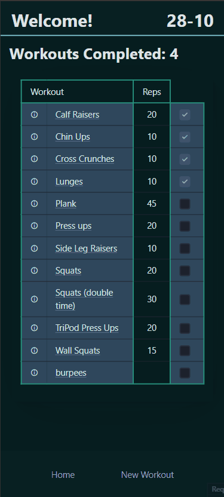
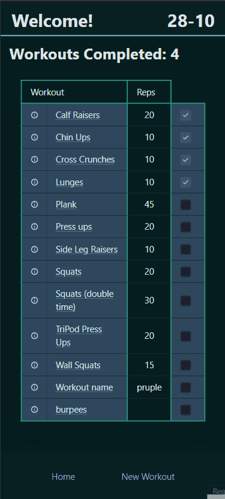
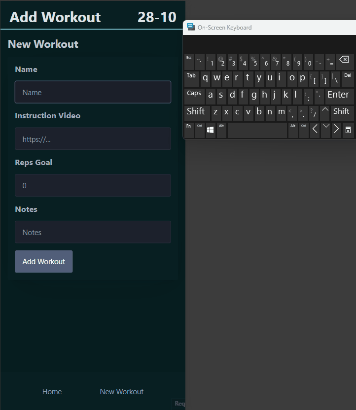
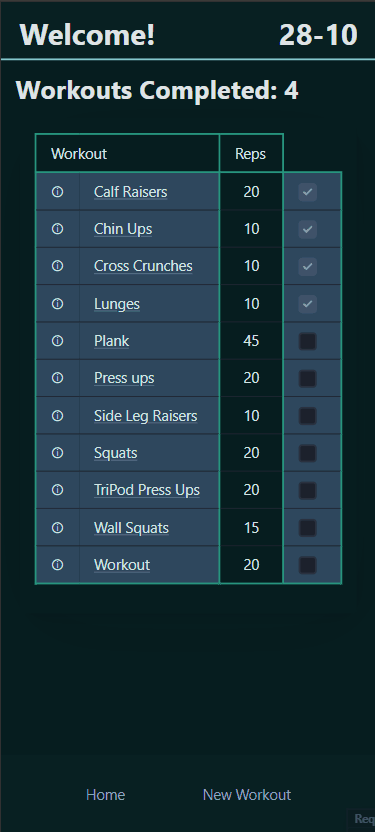
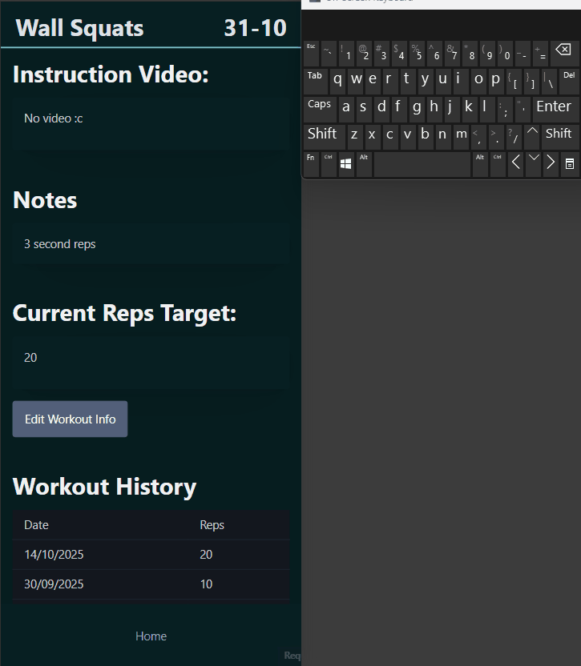

# Sprint 2 - A Minimum Viable Product (MVP)

## Sprint Goals

Develop a bare-bones, working web application that provides the key functionality of the system, then test and refine it so that it can serve as the basis for the final phase of development in Sprint 3.

---

## Implemented Database Schema

The sessions database stores the workout history of the user and allows us to see whether the workouts have been completed today. This uses the date stored in the date column. The reps is saved to show progress as the user may increase their reps as they continue working out weekly. 

The workouts database stores the information for

---

## Initial Implementation

The key functionality of the web app was implemented:

---

## Testing adding workouts 

Testing adding workouts to the list, by filling out the information on the new workout form, expected and unexpected. Workouts are added with the information inputted and displayed on the home page, containing the information needed Found that workouts could be uploaded without any reps assigned and that reps could be plain text.

### Changes / Improvements

Required the reps field to be filled and to be an integer
Added constraints to reps input and name input

---

## Testing editing and deleting workouts

Testing changing the workouts info, adding info, removing, unexpected values, etc. Info can be changed and removed easily, invalid links are discarded and shown as no video being added. Found similar problems to adding workouts with the reps allowed to be blank and non-integers. Deleting works as expected.

### Changes / Improvements

Required the reps field to be filled and to be an integer
Added constraints to reps input 

---

## Testing History of workout storage

Tested that a workout could be marked completed by checking the box. When it is checked the count of completed workouts goes up and the box is disabled. Going into the history section of a workout, previous history is displayed and when the workout is checked as completed for the day the new date gets added to the history. Everything works as intended.

---

## Sprint Review

This sprint has made the site fully functional, and it can now perform it's key functions well and efficiently. The end-user is happy with the functionality of the site and can use it easily without errors.

