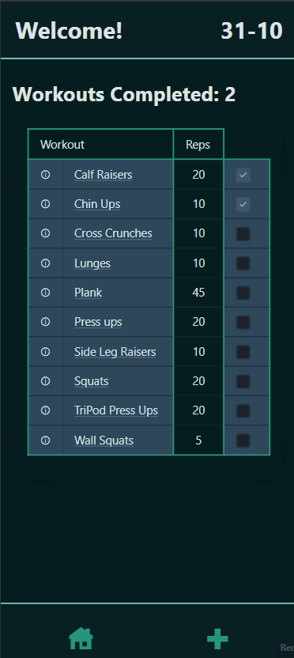
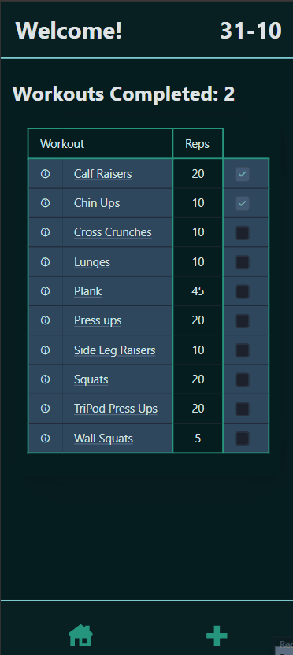

# Sprint 3 - A Refined and Complete System

## Sprint Goals

Develop the system until it is fully featured, with a refined UI and it satisfies the requirements. The system will be fully tested at this point.

---

## Final Implementation

The web app is fully implemented with a refined UI:

---

## Testing FEATURE NAME HERE

Tested the acessibility of the colours. Almost all meet the visibility requirement.

---

## Sprint Review

The UI is refined and the end user is happy with the design. All elements work.

